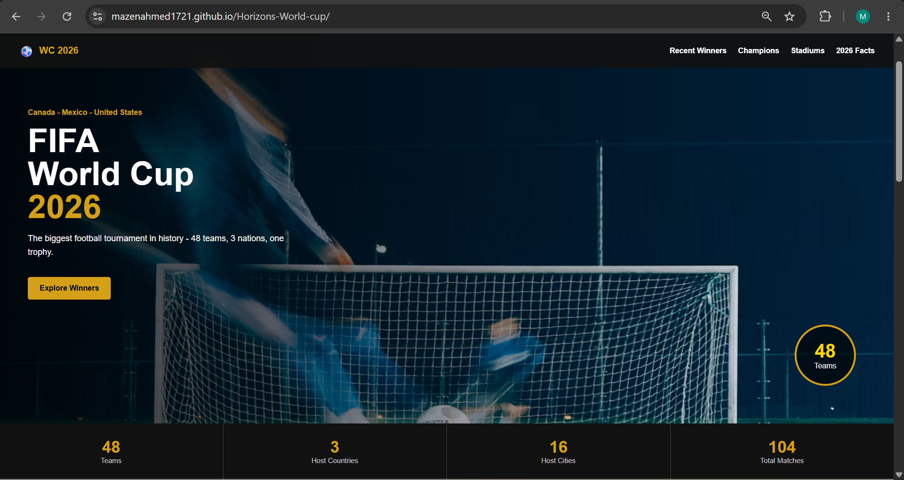

# FIFA World Cup 2026 Info Page 

*This is a project for #horizons.*

## Description
A simple, responsive website dedicated to the upcoming 2026 FIFA World Cup. It displays stats about the tournament, a list of recent winners, hall of champions, and a table of the main stadiums.

## Screenshots

## Motivation
I love football and I really wanted to practice my coding skills. I decided to build this from scratch without any frameworks to understand the core languages better. It took me about 16 hours of work, mostly tweaking the CSS for mobile screens and figuring out the JavaScript loops.

## Tech Stack
* HTML
* CSS
* JavaScript

## How to use it
Just click on the live deployed link! You can scroll through the sections, view the different stats, and if you are opening it on your phone, you can test the mobile navigation menu.

## How it works
* **HTML:** Sets up the structure of the page, including a manually written table for the stadiums.
* **CSS:** Handles all the styling, colors, and makes the website fully responsive using media queries.
* **JavaScript:** Used to dynamically generate the "Recent Winners" cards and the progress bars from an array of data. It also makes the mobile hamburger menu open and close.